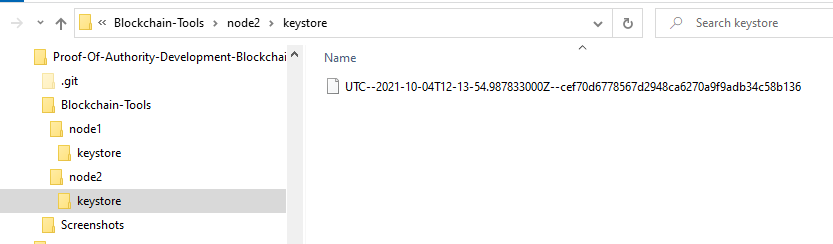

# Proof Of Authority Development Blockchain
This project work covers steps to setup a Private Testnet Blockchain that can be used to explore potentials for what Blockchain Technology can do in Financial Services space. This Testnet would allow developers the freedom of experiment because there is no real money involved, and this custom network is offline.

## Installations
- [MyCrypto](https://www.mycrypto.com/) Desktop App  
MyCrypto is a free, open-source, client-side interface that allows you to interact directly with the blockchain.  
In this project, we will use MyCrypto Desktop App to manage ethereum wallets and make transactions in the blockchain.  
To install MyCrypto Desktop App, please open your browser and navigate to the downloads page at https://download.mycrypto.com/.  
Based on the operatign system, download the installer, open the file, and follow the installation wizard.
    > Wallet setup
    > * Open up the MyCrypto app.
    > * Click "Create New Wallet" on the left.
    > * Choose "Generate a wallet".
    > * Use the "Mnemonic Phrase" option. MyCrypto will generate a unique mnemonic phrase for you, write down this phrase in order and store it in a safe place. Do not share this phrase with anyone, treat it like your banking password.
    > * You will need to confirm the phrase by clicking your words in order
    > * Once you are done, you will see the steps you will need to unlock your account in the future.
    > * Unlock your wallet by going to "View & Send" and pick "Mnemonic Phrase."
    > * Type your mnemonic phrase, with spaces (you can click the eye to view it), then continue to choose an address.
    > * Once you pick an address to unlock, copy the address on the right hand side.


- [Go Ethereum](https://geth.ethereum.org/) Tools  
Go Ethereum is one of the three original implementations of the Ethereum protocol. It is written in Go, fully open-source and licensed under the GNU LGPL v3.  
In this project, we will use Go Ethereum Tools to create our very own blockchain, from the genesis block to mining tokens and making transactions.
For installations, we shall use the application executable binary file using the following steps:  
  * Open your browser and navigate to the Go Ethereum Tools download page at https://geth.ethereum.org/downloads/
  * Scroll down to the "Stable Releases" section and proceed depending on your operating system to install "Geth & Tools 1.9.7".
  * After downloading the tools archive, open your "Downloads" folder, decompress the archive in the location of your preference in your computer's hard drive, and rename the containing folder as `Blockchain-Tools`.


## Set up custom Testnet Blockchain 

- Created a new project directory for the new network.  

  


- Create accounts for two (or more) nodes for the network with a separate datadir for each using geth. 

  Open a terminal window, navigate to the Blockchain-Tools folder and type the following command:
  ```
  ./geth account new --datadir node1
  ./geth account new --datadir node2
  ```  
  
  


- Network Creation
  * Run puppeth, name your network, and select the option to configure a new genesis block.
  * Choose the Clique (Proof of Authority) consensus algorithm.  
  * Paste both account addresses from the first step one at a time into the list of accounts to seal.  
  * Paste them again in the list of accounts to pre-fund. There are no block rewards in PoA, so you'll need to pre-fund.  
  * You can choose no for pre-funding the pre-compiled accounts (0x1 .. 0xff) with wei. This keeps the genesis cleaner.  
  * Complete the rest of the prompts to specify chain/Network ID  
  
  


- Export Genesis configuration

    * When you are back at the main menu, choose the "Manage existing genesis" option.  
    * Export genesis configurations. This will fail to create two of the files, but you only need networkname.json. 
    * You can delete the networkname-harmony.json file.  
    
      
    
    


- Initialize each node with the new networkname.json with geth.  

  Initialize the first node, replacing yournetworkname.json with your own:
  
  `./geth init <yournetworkname>.json --datadir node1`

  You should see this success message:  
  
  

  Run the same command for node2.

  `./geth init <yournetworkname>.json --datadir node2`


- Run the first node, unlock the account, enable mining, and the RPC flag. Only one node needs RPC enabled.  
  * Run the nodes in separate terminal windows with the commands

  `./geth --datadir node1 --unlock "SEALER_ONE_ADDRESS" --mine --rpc --allow-insecure-unlock`

  
  


- Set a different peer port for the second node and use the first node's enode address as the bootnode flag.  
  Be sure to unlock the account and enable mining on the second node!

  `./geth --datadir node2 --unlock "SEALER_TWO_ADDRESS" --mine --port 30304 --bootnodes "enode://SEALER_ONE_ENODE_ADDRESS@127.0.0.1:30303" --ipcdisable --allow-insecure-unlock`

  


You should now see both nodes producing new blocks, congratulations!  


## Send a Test transaction.

- Open up MyCrypto, Unlock your wallet using your mnemonic phrase and choose the address you want to inspect.

- Now you are going to connect MyCrypto with the blockchain you created. Follow the next steps.

  * Open up MyCrypto, then click Change Network at the bottom left
  * Click "Add Custom Node", then add the custom network information that you set in the genesis.
  * Make sure that you scroll down to choose Custom in the "Network" column to reveal more options like Chain ID
  * The chain ID must match what you came up with earlier.
  * The URL is pointing to the default RPC port on your local machine. Use http://127.0.0.1:8545.
  * Once you save and use the network, double-check that it is selected and is connected.

  

- Now that you are connected to your blockchain, you will need to load a keystore file you created and funded on the network.
  * If you are logged in to another wallet, you'll need to click Change Wallet on the top right, but make sure you are connected to your custom network.
  * On the left pane menu, click on "View & Send".
  * Next, click on the "Keystore File" option to continue.
  * A new window will pop-up, choose the keystore file for Node1 from browse option and the wallet would be loaded.

  

- Now we're going to send a transaction between Node 1 and Node 2 to test out the connection

  * Copy the pre-fund address into the "To Address" field, then fill in an arbitrary amount of ETH
  * Confirm the transaction by clicking "Send Transaction", and the "Send" button in the pop-up window.  
  
  
  
  * Click the Check TX Status when the green message pops up, confirm the logout.  
  
  
  
  * You should see the transaction go from Pending to Successful in around the same block time you set in the genesis.  
  
     
   
   

  * You can click the Check TX Status button to update the status.

  
  
  
